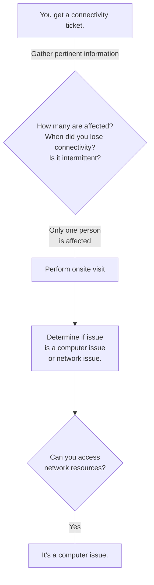

```mermaid
graph TD

A[You get a connectivity ticket.]
B{How many are affected?\nWhen did you lose connectivity?\nIs it intermittent?}
C[Perform onsite visit]
D[Determine if issue\nis a computer issue\nor network issue.]
E{Can you access\nnetwork resources?}
F[It's a computer issue.]

A-- Gather pertinent information ---B
B-- Only one person\nis affected ---C
C ---> D
D ---> E
E-- Yes ---F
```